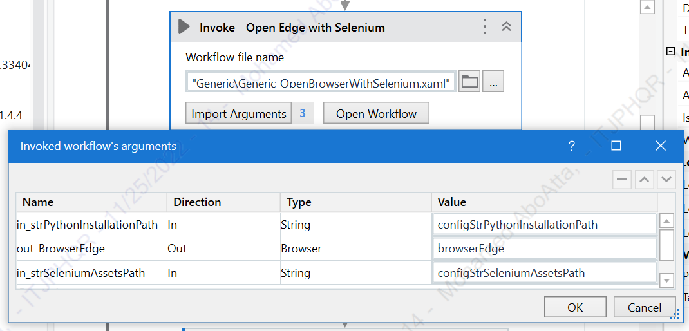
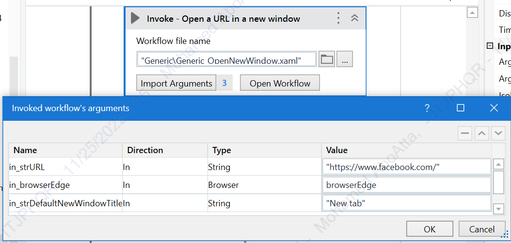
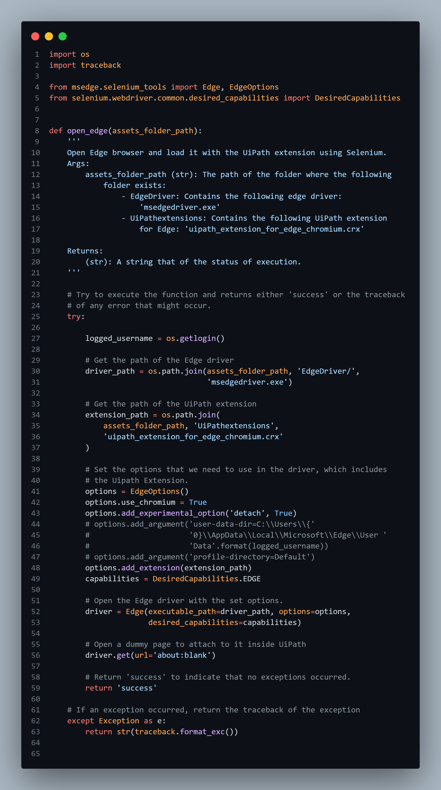
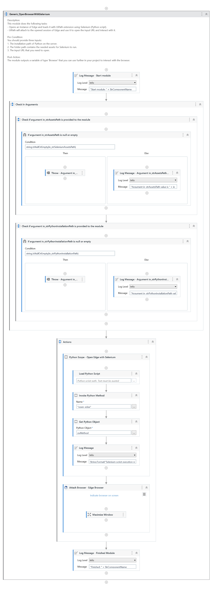
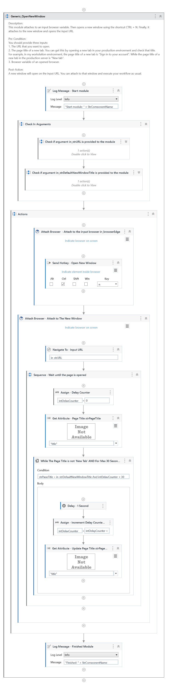

<!-- PROJECT SHIELDS -->
<!--
*** I'm using markdown "reference style" links for readability.
*** Reference links are enclosed in brackets [ ] instead of parentheses ( ).
*** See the bottom of this document for the declaration of the reference variables
*** for contributors-url, forks-url, etc. This is an optional, concise syntax you may use.
*** https://www.markdownguide.org/basic-syntax/#reference-style-links
-->

<a name="readme-top"></a>


<!-- PROJECT LOGO -->
<br />
<div align="center">
    

  <h3 align="center">Missing Edge Extension in UiPath Solution</h3>

</div>


<!-- TABLE OF CONTENTS -->
<details>
  <summary>Table of Contents</summary>
  <ol>
    <li>
      <a href="#about-the-project">About The Project</a>
      <ul>
        <li><a href="#built-with">Built With</a></li>
      </ul>
    </li>
    <li>
      <a href="#getting-started">Getting Started</a>
      <ul>
        <li><a href="#libraries">Libraries</a></li>
        <li><a href="#packages">Packages</a></li>
        <li><a href="#service-accounts">Service Accounts</a></li>
      </ul>
    </li>
    <li><a href="#usage">Usage</a></li>
    <li><a href="#roadmap">Roadmap</a></li>
    <li><a href="#contact">Contact</a></li>
    <li><a href="#acknowledgments">Acknowledgments</a></li>
  </ol>
</details>


<!-- ABOUT THE PROJECT -->
## About The Project

![product-screenshot]

* Project Name: Missing Edge Extension in UiPath Solution
* Version: v1.0.0
* Organization Department: Technology

### Description

This project includes two modules that are designed to overcome the following error:
> Cannot communicate with the browser, please check the UiPath extension.

The first module `Generic_OpenBrowserWithSelenium` opens the Edge browser, Using Python and Selenium, and loads it with the UiPath Extension.

The second module `Generic_OpenNewWindow` opens a new window from an already-opened browser.

<p align="right">(<a href="#readme-top">back to top</a>)</p>


### Built With

This project was developed using the following tech stacks:

* UiPath
* Python (Selenium)

<p align="right">(<a href="#readme-top">back to top</a>)</p>

<!-- GETTING STARTED -->
## Getting Started

In this section, I will give you instructions on setting up this project locally.
To get a local copy up and running follow these simple steps.

### Libraries

* pip
  ```sh
  pip install selenium
  ```
  
### Packages
* `Generic_OpenBrowserWithSelenium`:


  * Description: 
    * This module does the following tasks:
      * Opens an Instance of Edge and loads it with UiPath extension using Selenium (Python script).
      * UiPath will attach to the opened session of Edge and provide you with an output variable of type Browser; which you can use to perform your workflow.
  * Pre-Condition:
    * You should provide two inputs:
      1. The installation path of Python on the server.
      2. The folder path contains the needed assets for Selenium to run.
  * Post-Action:
    * A new blank page will be opened with the UiPath extension loaded. The module will give you an output variable of type Browser, which you can use to attach to the opened browser and perform your workflow.


* `Generic_OpenNewWindow`:
  * Description:
    * This module attaches to an input browser variable. Then opens a new window using the shortcut CTRL + N. Finally, it attaches to the new window and opens the input URL.
  * Pre-Condition:
    * You should provide three inputs:
      1. The URL that you want to open.
      2. The page title of a new tab. You can get this by opening a new tab in your production environment and checking that title. for example, in my workstation environment, the page title of a new tab is `Sign in to your account`. While the page title of a new tab in the production server is `New tab`.
      3. Browser variable of an opened browser.
  * Post-Action:
    * A new window will open on the input URL. You can attach it to that window and execute your workflow as usual.


### Service Accounts
* None

<!-- USAGE EXAMPLES -->
## Usage

### Steps

* Import the module `Generic_OpenBrowserWithSelenium` and provide its inputs.


* For each website that you need to automate, import the module `Generic_OpenNewWindow` and provide its inputs.


### Screenshots

* Python Script:


* `Generic_OpenBrowserWithSelenium` Module:


* `Generic_OpenNewWindow` Module:


<p align="right">(<a href="#readme-top">back to top</a>)</p>


<!-- ROADMAP -->
## Roadmap

- [x] Open Edge with UiPath extension installed and active using Selenium.
- [x] Attach to the opened browser using UiPath.
- [x] Open new windows for automating multiple websites at the same time.
- [ ] Research the issue of opening legacy websites in IE Mode in Edge using Selenium.

<p align="right">(<a href="#readme-top">back to top</a>)</p>

<!-- ACKNOWLEDGMENTS -->
## Acknowledgments

Resources that I found helpful during the development of this project:

* [Stackoverflow: Unable to launch Edge Browser using Selenium Python EdgeOption](https://stackoverflow.com/questions/67033877/unable-to-launch-edge-browser-using-selenium-python-edgeoption)

<p align="right">(<a href="#readme-top">back to top</a>)</p>

<!-- CONTACT -->
## Contact

Mohamed AbdelGawad Ibrahim - [@m-abdelgawad](https://www.linkedin.com/in/m-abdelgawad/) - <a href="tel:+201069052620">+201069052620</a>

<p align="right">(<a href="#readme-top">back to top</a>)</p>


<!-- MARKDOWN LINKS & IMAGES -->
<!-- https://www.markdownguide.org/basic-syntax/#reference-style-links -->
[product-screenshot]: images/extension-error.png
